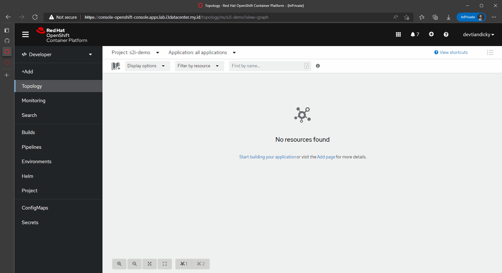

# App Deployment using s2i

## Prerequisite

* app repository url

## Steps

1. Login to Web Console then select +Add from side bar.

2. Select 'From Git' located in 'Git Repository' section.

3. Fill the required repo url.

> **Note**
> Since the source code located inside another directory we need to add context value located in `Show advanced Git options` then add your source code directory on Context dir field.

4. After the code successfully identified by s2i, the console will automaticaly select the appropriate builder image.

5. On General section add application and name.

6. To expose app to external traffic we need to enable service and route for our application by selecting checkmark on `Create a route to the Application` section 

7. After all config is configure click create and build process will be started, once build process is completed and the app is started we can access the app by click the expose route to our application.

The gif below is showing deployment of an app using s2i process

