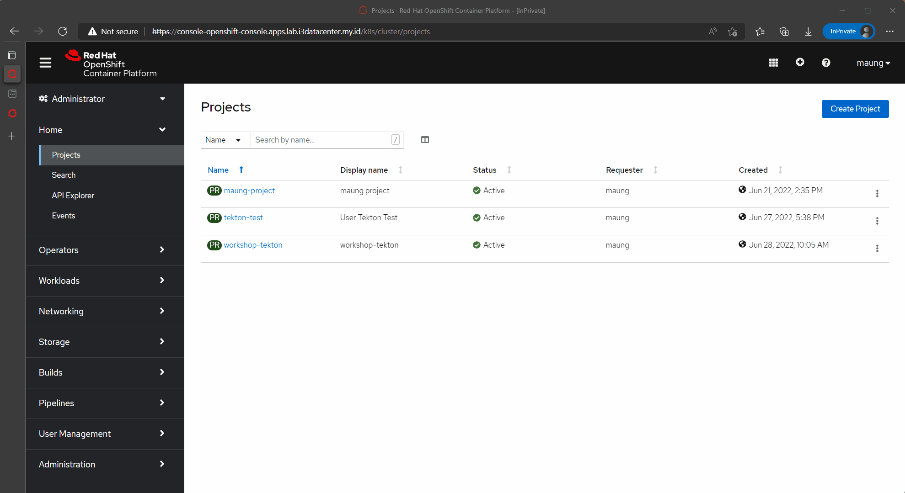
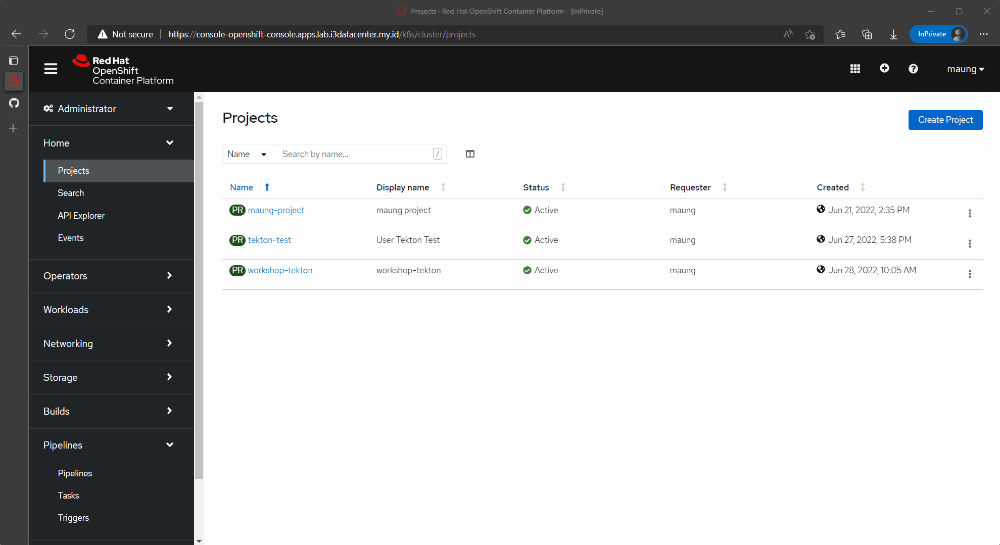
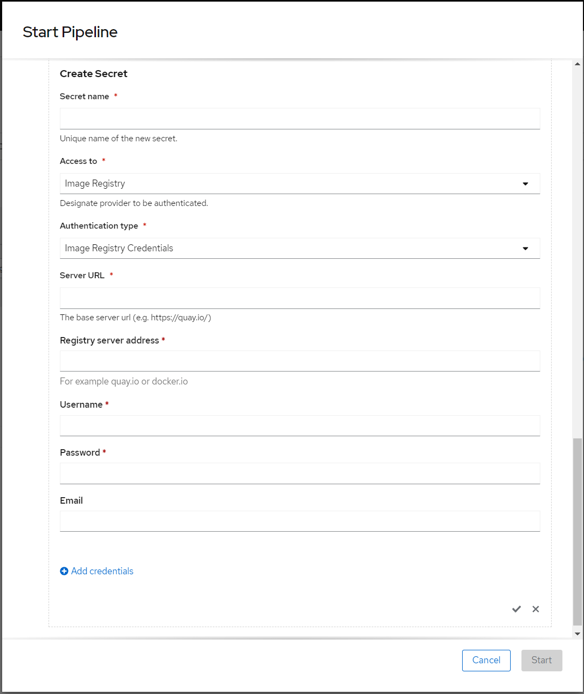
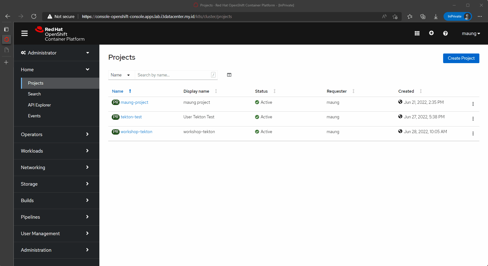

# Setups Tekton from web-console

## Prerequisite

Before we can create ci/cd solution here following thing that user required.

* Project
* ServiceAccounts (using web console user going to use default sa called 'pipeline')
* Secret
* PVC

## Steps

### Create PVC

Persistent Volumes is required due to ephemeral nature of container, PV is use to store source code and shared to each steps, on deploy directory containing yaml file to create pvc to be used by pipeline, below is how to create PVC from web console.

### Create Task

In this project we using 3 custom task that we going to use by our pipeline. the task located on `./tekton/task-` To add task into our namespace/project via web console shown by image below.

### Create Pipeline

Adding pipeline work the same way as adding other crd, on web console we need to copy the yaml source, located in `./tekton/pipeline-` and then click create

## Start the Pipeline

Starting pipeline go to side navigation bar then select pipeline section then select pipeline you want to start, select Action and then select Start, after that Start Pipeline popup will appear, user will need to fill parameters required by pipeline, in this case all parameter has been provided by the pipeline script.

User only needs to define two values, the first one is workspace where pvc of the pipeline going to define, then a secret to store credential used to pushing image to the registry.

Fill the required field, make sure access to is set for `Image Registry`, Authentication type is set to `Image registry Credential`, for server url add address of docker hub `https://index.docker.io/v2/` and Server URL is set to `docker.io`, finally add your dockerhub username and password.

The detail of how to start a pipeline is shown below

