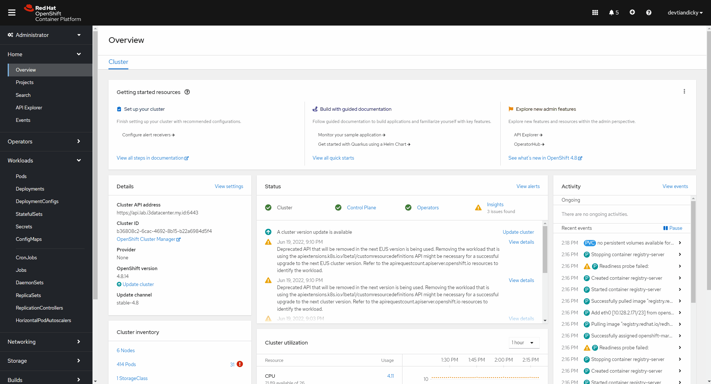

# Setups Tekton for deployment

## Prerequisite

1. [OC or kubectl](https://mirror.openshift.com/pub/openshift-v4/clients/ocp/4.10.18/) CLI tools installed

> Download Link From mirror.openshift.com. download file openshift-client-yourOS

2. DockerHub account and its access token

> To create DockerHub access token login with your account then go to account settings > Security > New Access Token > then give description and Access permissions minimum 'Read & Write'.

3. [Tekton CLI ](https://tekton.dev/docs/cli/)

> Optional:
> [Tekton Extension on  Visual Studio Code](https://marketplace.visualstudio.com/items?itemName=redhat.vscode-tekton-pipelines) and GitHub Account

## Setups

### 1. Secret

Create secret to store DockerHub credential for pushing image that build by pipeline

```bash
kubectl create secret docker-registry <secret-name> \
  --docker-server=$CONTAINER_REGISTRY_SERVER \
  --docker-username=$CONTAINER_REGISTRY_USER \
  --docker-password=$CONTAINER_REGISTRY_PASSWORD
```

> The container registry server URL, for Quay.io its quay.io and for DockerHub it is https://index.docker.io/v2/

### 2. Service Account

Secret will be patch to service account so the  service account have necessary credential to push image to external container registry, below is how Create service account and map the secret build above

```bash
kubectl create serviceaccount <serviceaccount-name>
```

Now patch the service account so the service account have container registry credentials:

```bash
kubectl patch serviceaccount <serviceaccount-name> \
  -p '{"secrets": [{"name": "<secret-name>"}]}'
```

### 3. PVC

Persistent Volumes is required due to ephemeral nature of container, PV is use to store source code and shared to each steps, on deploy directory containing yaml file to create pvc to be used by pipeline, below is how to create [Persistent Volumes Claims](../deploy/pipeline-pvc.yaml)

```bash
kubectl apply -f ./deploy/pipeline-pvc.yaml
```

## Tasks

### [Clone Task](../tekton/task-git-clone.yaml)

The Main function for Clone Task is to clone our repo to be built by next step. This Task contains 2 steps, the first one called clean source to clean working directory from previous pull since pvc won't clear itself after task or pipeline is finished. The second task is git-clone where the clone possess is run. This task utilizes some parameters to make this task reusable. Below is a description of parameters being used.

Parameters Name | Parameter call | Description
---------|----------|---------
 REPO-URL | $(params.REPO-URL) | URL of the repository
 REPO-REVISION | $(params.REPO-REVISION) | Branch of repo

 To Apply/run this task either as independent task or as a part of pipeline we must apply this file using oc or kubectl command

 ```bash
 kubectl apply -f ./tekton/task-git-clone.yaml
 ```

### [Build Task](../tekton/task-build-image.yaml)

The build process is self-explanatory, it takes the source code and builds an image from dockerfile on that source. There are 4 steps on this build, the first one is not mandatory and its function to check source where the script contains a calling parameter to check if the source contains the dockerfile and checking its directory, the second steps is using buildah to build the image, after the image is build the next steps is pushing the image to registry using the same buildah process as the build, the last steps is to show image digest of the image that being build.

> Note: Since service account already contains credential for registry as a dockerconfig we don't need to login manually to the registry

Below are parameters being used in this task.

Parameters Name | Parameter call | Description
---------|----------|---------
 IMAGE | $(params.IMAGE) | Name of the image to build
 DOCKERFILE | $(params.DOCKERFILE) | Path to the Dockerfile
 CONTEXT | $(params.CONTEXT) | Path to the build context
 BUILD_EXTRA_ARGS | $(params.BUILD_EXTRA_ARGS) | Additional arguments to pass to the build
 PUSH_EXTRA_ARGS | $(params.PUSH_EXTRA_ARGS) | Additional arguments to pass to the push
 STORAGE_DRIVER | $(params.STORAGE_DRIVER) | buildah storage driver
 TLSVERIFY | $(params.TLSVERIFY) | Verify the TLS on the registry endpoint (for push/pull to a non-TLS registry)
 FORMAT | $(params.FORMAT) | The format of the built container, oci or docker

  To Apply/run this task either as independent task or as a part of pipeline we must apply this file using oc or kubectl command

 ```bash
 kubectl apply -f ./tekton/task-build-image.yaml
 ```

### [Deploy Task](../tekton/task-deploy.yaml)

Deploy task contains 3 steps, the first steps are to check manifest directory and its file, the second steps are deployment steps using kubernetes manifest file via `oc apply` command, after deployment the next steps is to check the service, route and pod status after manifest file is applied. Below are parameters being used in this task.

> Note: Theres no oc login command due to our service account already have access to current namespace.

 Below are parameters being used in this task.

Parameters Name | Parameter call | Description
---------|----------|---------
 MANIFEST | $(params.MANIFEST) | Directory of the manifest file for deployment
 DEPLOY | $(params.DEPLOY) | File name for deployment

## [Pipeline](../tekton/pipeline-demo.yaml)

After all task is added to the namespace now user need to add pipeline file, where all task mention above is bundle up and run as one ci/cd process. In general we need specified all parameter being used then add task to run, in this case the first task to run is [task-git-clone](../tekton/task-git-clone.yaml) after the source is clone the next step is [task-build-push-image](../tekton/task-build-image.yaml) to build and push images to the registry, after those two task is completed the final task is [task-deploy](../tekton/task-deploy.yaml) using manifest file to deploy our app via oc cli command.

To add pipeline to namespace run this following command

```bash
kubectl apply -f ./tekton/pipeline-demo.yaml
```

### Running the pipeline

To run the pipeline theres two option you can do, the first one is using tkn cli and the second one is create PipelineRuns file, to run tekton pipeline via cli user can use following command.

```bash
tkn pipeline start <pipeline-name> \
--serviceaccount=<serviceaccount-name> \
--workspace name=source,claimName=<pvc-name> \
```

> Note: When running the command above you will prompt to input each parameter required by the pipeline, you can just enter each parameter to use its default value or you can input the value according to your needs.

To help running the pipeline we can create PipelineRuns file, where it contains parameters that user specify, workspace being used by the pipeline and service account, to add PipelineRuns to the name space use following command.

```bash
kubectl apply -f ./tekton/pipeline-run.yaml
```

If there's no PipelineRuns existing, the first time we apply the PipelineRuns file will trigger pipeline to run, other way to run the PipelineRuns is via web console as shown below.



We can check its progress using tkn cli or tekton extension for vs code, the command used to see the status using tkn cli is shown below.

```bash
tkn pipelinerun list
tkn pipelinerun describe <PipelineRuns-name> 
tkn pipelinerun logs <PipelineRuns-name>
```
